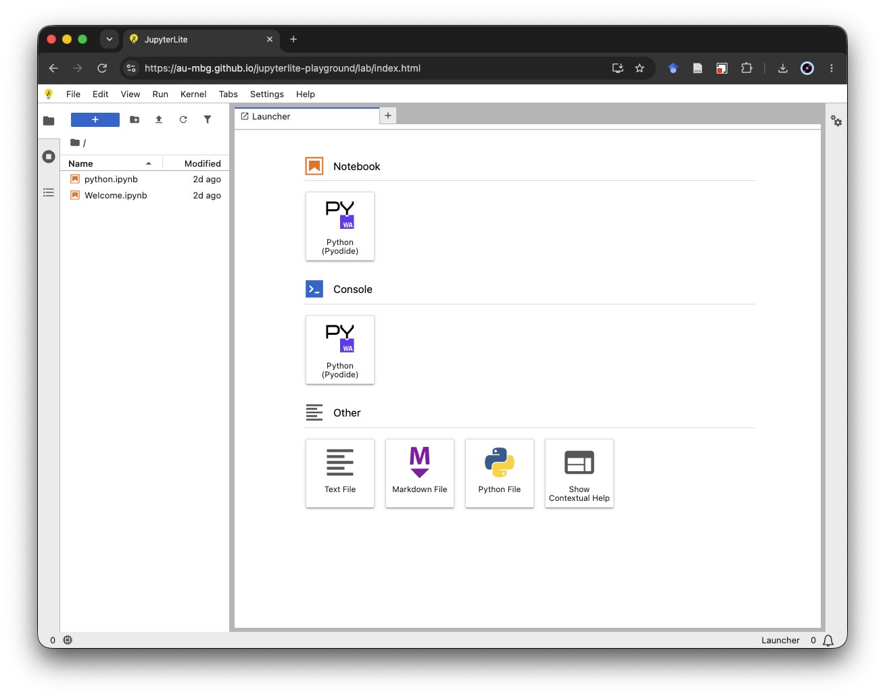
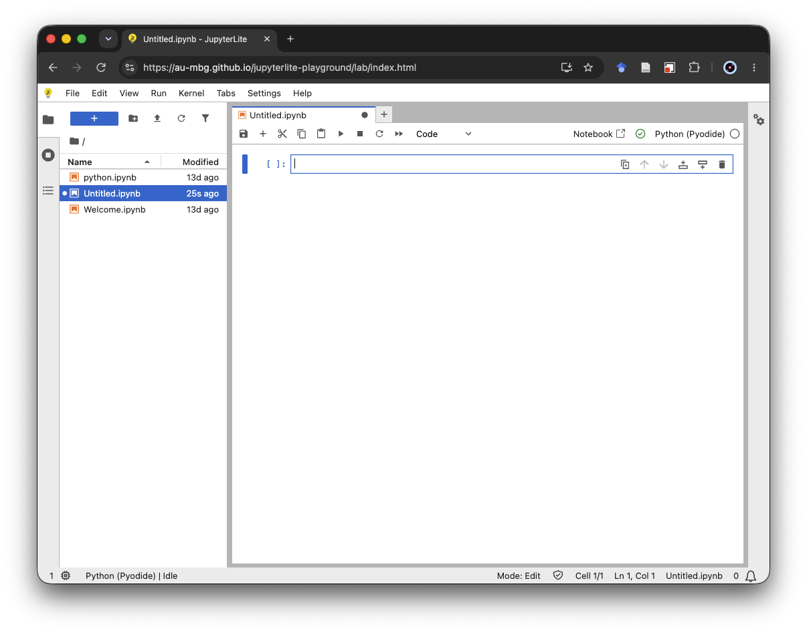
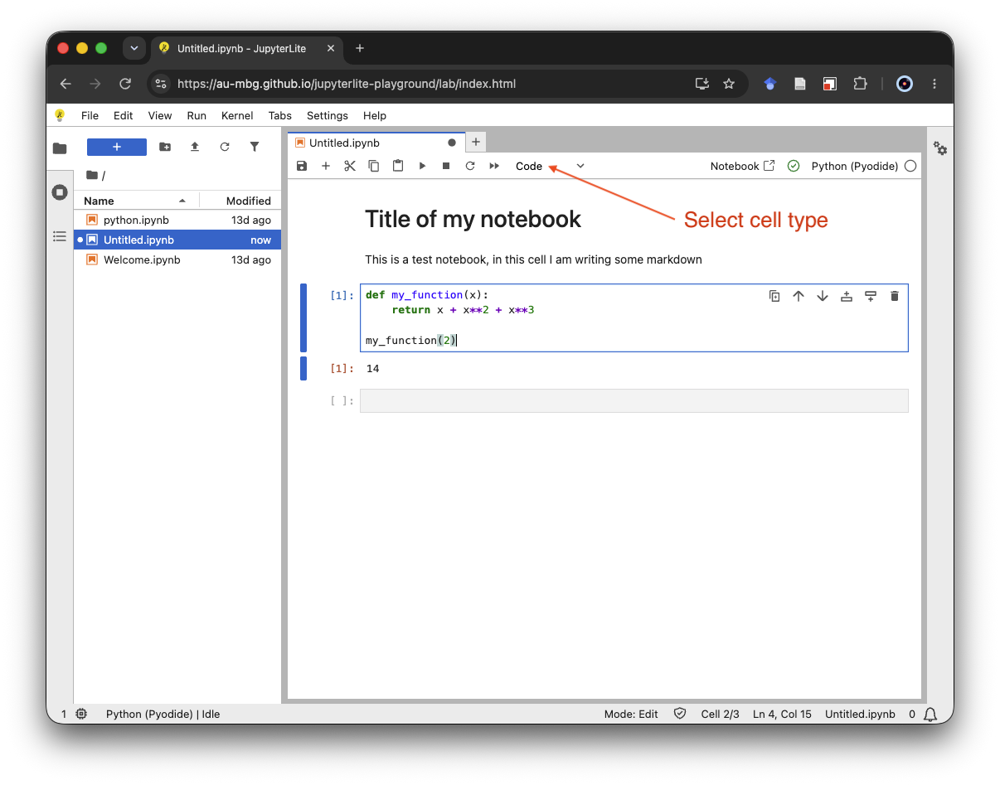
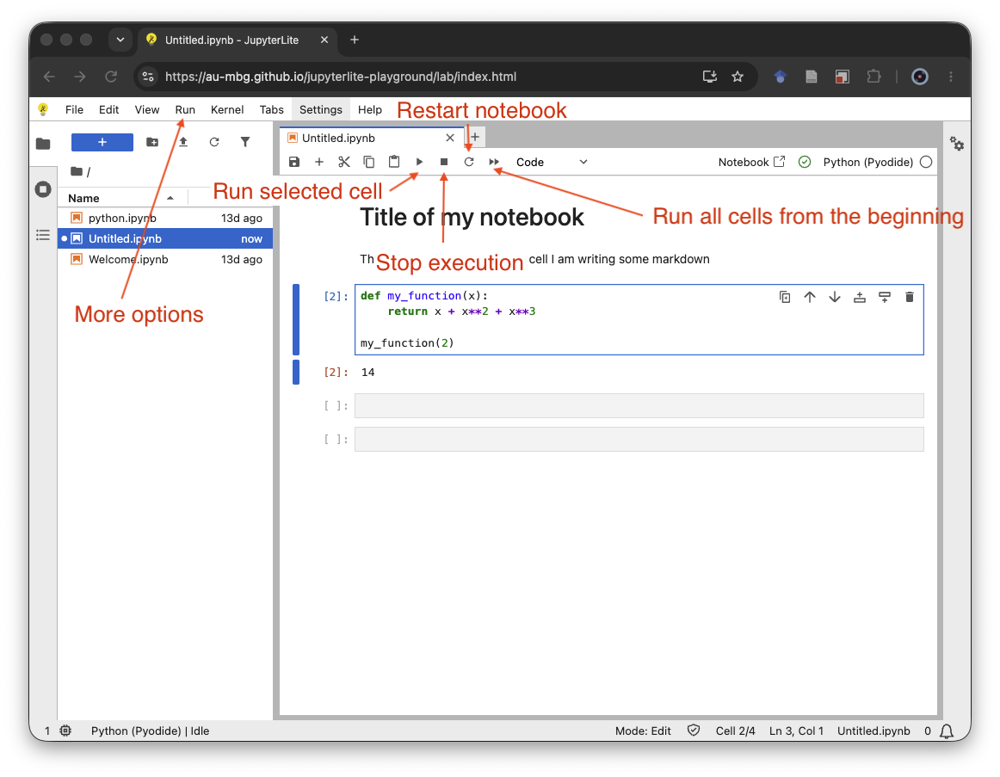
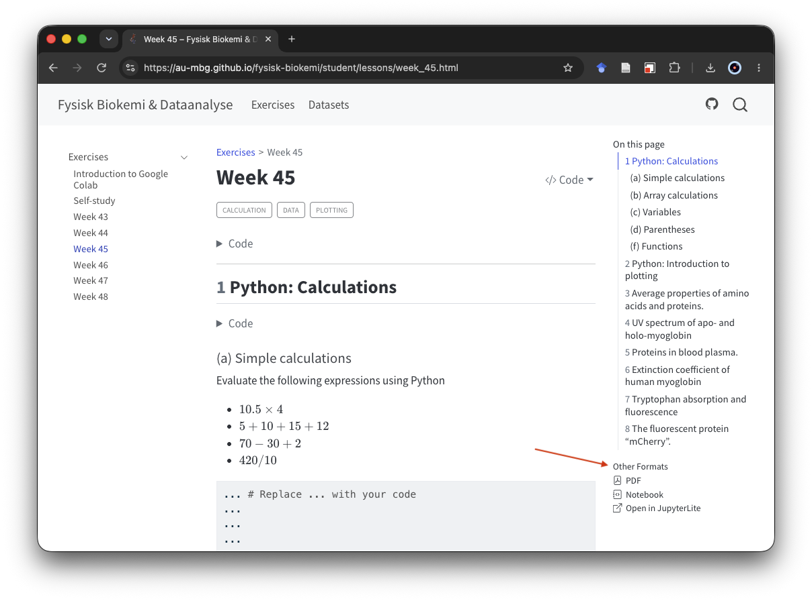
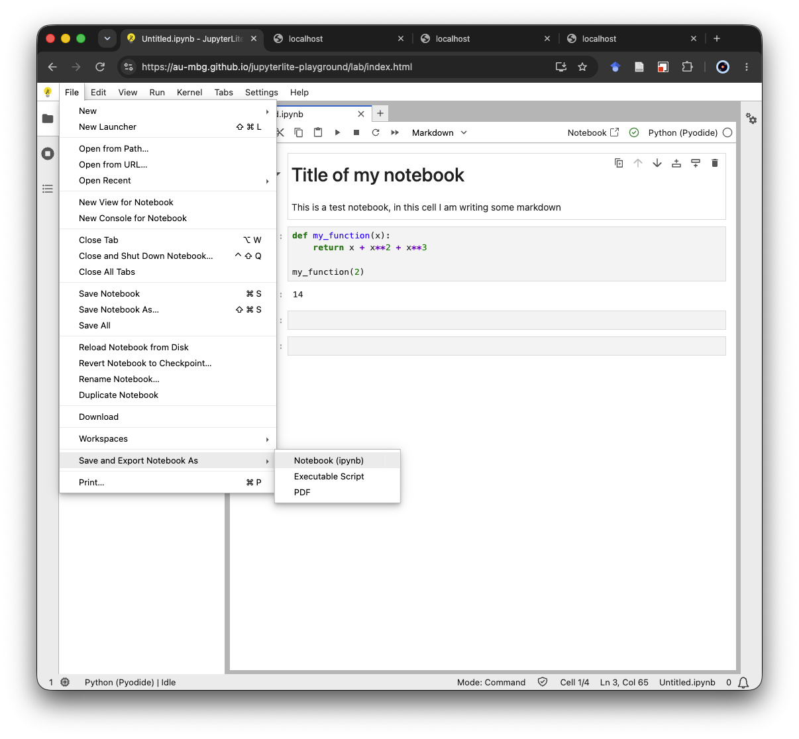
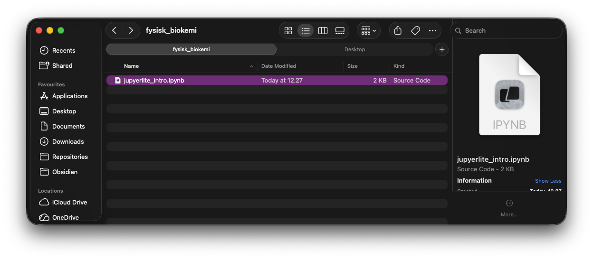
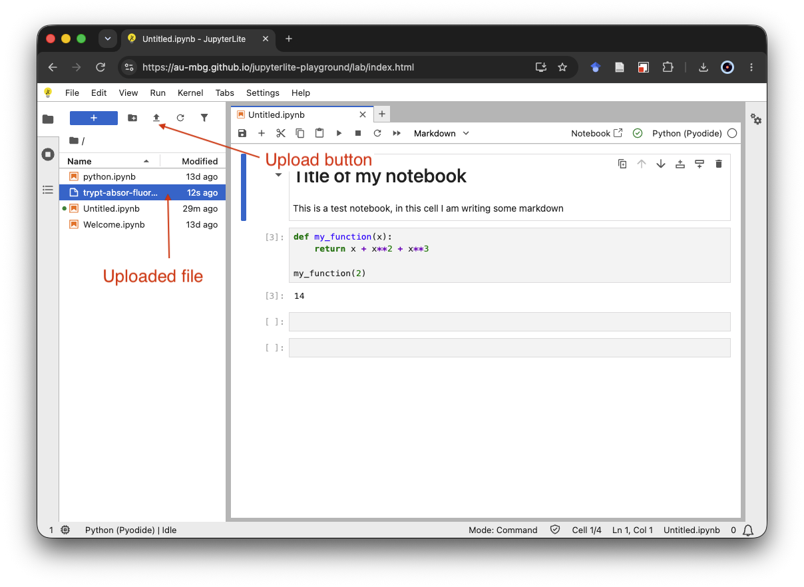

In this course we will use JupyterLite to work with Python for data analysis. 

JupyterLite is a browser-based version of Python that allows us to get up and running quickly without having to install anything on our machines. The exercises you've done in the "Introduktion til Livets Molekyler" course use the same technology under the hood, but we will now use a more full-fledged version as we work towards doing more complex tasks with Python.

## JupyterLite Introduction

JupyterLite can be accessed at this webpage: [https://au-mbg.github.io/jupyterlite-playground/lab/index.html](https://au-mbg.github.io/jupyterlite-playground/lab/index.html)

When you first access the page, you should see something like what is shown below.

{.lightbox fig-align="center" width="90%"}

JupyterLite is a JupyterLab distribution that runs in the browser. This means you can run 
Python programs and notebooks in JupyterLite without having to install anything. 

## Working with notebooks in JupyterLite

On the home page of JupyterLite, also called the *launcher*, you can click the button that 
says `Python (Pyodide)` to create a new notebook. You will then arrive at a page like the one shown below.

{.lightbox fig-align="center" width="90%"}

This notebook is a document that can contain both code and text, with the two types separated into different cells. The Python you worked with in IMOL is very similar to one of these code cells. 

{.lightbox fig-align="center" width="90%"}

To see the output produced by code in a notebook, we need to *run* or *execute* its code cells. There are several ways to control cell execution:

- `▶`: Runs the currently selected cell. You can also use the keyboard shortcut .
- `▶▶`: Restarts the notebook and runs all cells from top to bottom.
- `⏹`: Stops execution. This is useful when code keeps running without finishing or when you notice a mistake and do not want to wait for execution to finish.
- `↻`: Restarts the notebook without running the cells again.
- `Run`: Opens a menu with additional options for running cells.

{.lightbox fig-align="center" width="90%"}

::: {.callout-note title="Run cells in order"}
When you open an exercise, start at the top of the notebook and run the cells in order. The first setup cell may take a little longer to run because it prepares the course software. If you restart the notebook, run the cells from the top again before continuing your work.
:::

## Opening course notebooks

The exercises in this course are provided as notebooks that can be opened
directly in JupyterLite. On the course website, open the exercise you want to
work on and click `Open in JupyterLite` under **Other Formats**.

{.lightbox fig-align="center" width="90%"}

JupyterLite will open and import a copy of the exercise notebook. If the
notebook does not open automatically, locate it in the JupyterLite file browser
and double-click it.

Alternatively, click `Notebook` to download the notebook to your computer. You can then upload it to JupyterLite as described below.

## Notebooks as files

The notebooks we work with in JupyterLite are a type of file, namely an IPython notebook (`.ipynb`). Throughout the course we will work with several notebooks and it is important to 
keep track of them. 

::: {.callout-note title="Finding and organizing files on your computer" collapse=true}
This course assumes that you know how to create folders, locate downloaded
files, move and rename files, and recognize common filename extensions such as
`.ipynb`, `.csv`, and `.xlsx`.

If you are unfamiliar with working with files and folders, consult the relevant
guides below.

### macOS

- [Use the Finder on Mac](https://support.apple.com/guide/mac-help/use-the-finder-mchlp2605/mac)
- [Organize your files in Finder](https://support.apple.com/guide/mac-help/organize-your-files-in-the-finder-mchle9f0a1b2/mac)
- [Show filename extensions on Mac](https://support.apple.com/guide/mac-help/show-or-hide-filename-extensions-mchlp2304/mac)

### Windows

- [Use File Explorer in Windows](https://support.microsoft.com/en-us/windows/experience/fileexplorer/file-explorer-in-windows)
- [Find your files and apps in Windows](https://support.microsoft.com/en-us/windows/experience/storage-filemanagement/find-your-files-and-apps-in-windows)
- [Common filename extensions in Windows](https://support.microsoft.com/en-us/windows/experience/storage-filemanagement/common-file-name-extensions-in-windows)

In particular, we recommend enabling the display of filename extensions. This
makes it easier to distinguish notebooks, datasets, spreadsheets, and other
types of files.
:::

You should therefore create a folder (also called a directory) on your computer in a location that you can find, perhaps in your Documents folder or in a cloud storage folder such as Dropbox, iCloud, or OneDrive. This folder could be called `fysisk_biokemi` or another name that clearly communicates its purpose. 

Once you've finished working on a notebook in JupyterLite, you should export a backup to this folder. To download the notebook to your computer, select `File > Save and Export Notebook As > Notebook (ipynb)`, as shown in the screenshot below. 

{.lightbox fig-align="center" width="90%"}

Once you've downloaded the notebook, you should move it to the `fysisk_biokemi` directory on your computer. For example, the folder might look like this:

{.lightbox fig-align="center" width="90%"}

### Opening a saved notebook

To continue working on a notebook that is stored on your computer, upload the `.ipynb` file to JupyterLite. Click the `⬆` button in the JupyterLite file browser and select the notebook using your computer's file browser. Once the notebook appears in the JupyterLite file browser, double-click it to open it.

{.lightbox fig-align="center" width="90%"}

### Persistent storage in JupyterLite 

As you use JupyterLite, you will notice that it also saves your work. However, this is done in your browser's local storage. You should **NOT** rely on this as a mechanism to store your notebook long term, as it may be reset by, for example, clearing your browser history or cookies. It will also not persist if you use another browser or another machine. 

## Data files 

Many of the exercises we will work on in the course are about analyzing data and often this data will come in the form of files, such as `.csv` or `.xlsx`. 

You should also store these data files on your machine in the same folder (or a subfolder) as you store the notebooks. The screenshot below illustrates one way of managing this.

{.lightbox fig-align="center" width="90%"}

::: {.callout-warning}
Reproducing results, including data analysis, is essential in science. It is therefore important to develop good data-management practices that allow you to return to data you have worked with previously.
::: 

You will need to upload these files to JupyterLite to work with them. Use the same `⬆` button described above for uploading a saved notebook, then select the data file using your computer's file browser.

JupyterLite has its own file system in your browser. Uploading a file creates a separate copy in this file system; it does not create a live connection to the original file on your computer. If you change the original file, you will need to upload it again for those changes to become available in JupyterLite.

It is generally easiest to keep the notebook and its data files in the same folder in JupyterLite. A file in the same folder as the notebook can be referred to by its filename, for example `experiment.xlsx`. If you organize your data in a subfolder called `data`, the corresponding relative path is `data/experiment.xlsx`.

::: {.callout-tip title="If something goes wrong"}
- Make sure that you have run all earlier cells in the notebook, then try the cell again.
- If necessary, restart the notebook and run all cells from the top.
- Check that the required data files are visible in the JupyterLite file browser and that the path in the notebook matches their location.
- If work stored in the browser is unavailable, upload your latest exported `.ipynb` file.
- Before closing JupyterLite or clearing browser data, export a fresh `.ipynb` backup to your computer.
:::
